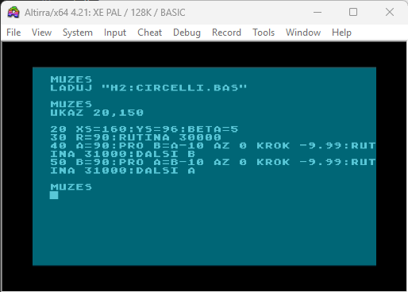
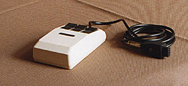

# ATARI XL/XE snippets

This repository contains short programs or parts of programs, helper programs, etc. from my archive. Source codes are in [src](./src/) directory, some "releases" in [releases](./releases/) directory and some descriptions in [doc](./doc/) directory.

## [Dictionary](./src/SLOVNIK1.LST.txt)

This program in ATARI BASIC is interesting only in that, unlike the programs for ATARI at that time, it does not have a fixed length allocated in memory for individual items. Each item and its meaning can vary in length. An index array is created containing pointers to the items, which is used for sorting - items are not physically moved in memory, but only the pointers in the index array are moved. The sorting algorithm used is "Bubble sort". Since the list of items is sortedg, a faster algorithm  "binary search" can be used for searching. Source code is in "SLOVNIK1.LST.txt" file.

## [8035 microcontroller monitor/disassembler](./src/8035MON.TBL.txt)

It was designed for working with programs and the contents of EPROM memory for the microcontroller 8035. It includes the following functions: LOAD, SAVE, DIR, MONITOR, DISASSEMBLER, MEMORY DUMP, BINARY DUMP, FIND, MOVE, FILL, SUMM, SUBTRACT, MULTIPLICATE, DIVIDE, FILL, CLEAR. Program is not fully finished. Source code for TURBOBASIC XL is in "8035MON.TBL.txt" file.

## [Faster circle and ellipse](/src/CIRCELLI.LST.txt)

Implementation of faster algorithm for drawing circle and ellipse in **ATARI BASIC** suitable for drawing by **pen plotters**. Usual algorithms use goniometric functions for calullation of coordinates for each point which is slow. Algorithm published in [^1] uses goniometric function calulation only one times. 

| **Variable** | **Meaning** |
| -------- | ------- |
| XS, YS | coordinates of the center |
| R | radius |
| A, B | semi-axis of the ellipse  - always > 0 |
| BETA | constant angular increment |
| X0, Y0 | coordinates of the starting point |

## [TURBO 2000 BASIC SAVER](./src/basavtos.mal.txt)

Programm determined for using together with Turbo 2000 operating system **TOS4.1**. ATARI BASIC programms could be saved using TURBO 2000 in several blocks with size 1kB by similar way like CSAVE. TURBO 2000 BASIC SAVER makes possible to save ATARI BASIC programm in one large block, where the modified address of programm in memory can be changed and written into header. Programm is written fully in assembler MAC/65. An [executable](./releases/BASAVTOS4.COM.xex) and short [user guide](./doc/T2000BasicSaver.md) are available. ATARI tape recorder with TURBO 2000 modification is necessary.

## [Czech ATARI BASIC](./releases/csbasic.com.xex)

In Czechoslovakia and other countries, some people in the 1980s and 1990s believed that learning to program would be easier if the keywords, function names, and error messages of a programming language were translated into their native language. This was possible even with ATARI BASIC.

An article by Thomas Tausend in Computer Kontakt magazine, issue 8 (1986)[^2], described the principles and steps for modifying ATARI BASIC in this way. Based on this article, a Czech version of ATARI BASIC was created. The programs used to modify and save ATARI BASIC have not been preserved, but the modified version of BASIC itself has survived.

The file [CZ_ATBasic.txt](./doc/CZ_ATBasic.txt) contains a reconstructed "dictionary." For loading a program, the command "LADUJ" is used; for listing it, "UKAZ"; and for running it, "DELEJ." The file "CIRCELLI.CZL.txt" contains a "Czech" version of the program listing for CIRCELLI program.

## [GR8 to 8IC Picture Converter](./src/GR88IC.TBL.txt)

Tool for conversion two color pictures in **Design Master** format to 8IC format, written in TURBOBASIC XL. The difference compared to the "Design Master" format is that the 8IC format includes the contents of four color registers at the end of the file, in the order 712, 708, 709, and 710.

## [Character frequency analyse](./src/CHARFREQ.TBL.txt)

This program written in TURBOBASIC XL loads text file, converts all letters to uppercase, removes all spaces and calulates the number of occurrences of individual letters of the alphabet. It is useful for decoding longer text encrypted using substitutional cipher. Text file should contain ASCII letters only.

## [S.A.M loader](./src/SAMLOAD.TBL.txt)

Loads and displays pictures made in S.A.M Painter. Program is written in TURBOBASIC XL.

## [S.A.M to MicroPainter converter](./src/SAMMIC.TBL.txt)

Loads, displays pictures made in S.A.M Painter, and then saves it in MicroPainter's format. Program is written in TURBOBASIC XL.

## [News Room photo converter](./src/PHOTOLOA.TBL.txt)

Loads and displays "photos" made in **News Room** suite, then saves it in **Design Master** format.

## [Text in GRAPHICS 8 mode](./src/psani5.mal.txt)

Assembler routine writes text in GRAPHICS 8 mode.

## [Character rotation](./src/otoc.mal.txt)

Assembler routine for rotation of characters.

## [TROSAT - Spectrum pictures saver](./src/TROSAT.LST.txt)

This program, partially in ATARI BASIC and partially in machine code, can load pictures from casette with program for **ZX Spectrum** and save them in **Design Master**  format, of course only in two colors. The loading routine is borrowed from similar program [TRAPSAT](http://atari.turiecfoto.sk/soft/trapsat.zip) which could translate programs from ZX BASIC to ATARI BASIC / TURBOBASIC XL. The ATARI tape recorder with TURBO 2000 modification is necessary. Some pictures are available in [doc](./images/) directory.

## [**Tesla EM 3 WN 16607** mouse handler](./src/teslamys.mal.txt)

Handler for **Tesla EM 3 WN 16607** mouse in assembler. It is modified program from original in [^3]. Detailed [user guide](./doc/TeslaMouse.md) is available. There is also [demo](./src/MOUSDEMO.LST.txt) program in ATARI BASIC available.

[^1]: Ladislav Drs: Plochy ve výpočetní technice. SNTL 1984.  
[^2]: Thomas Tausend Softwarebastelei. Computer Kontakt 8/1986  
[^3]: Clausdorf, Dittrich: Tips & Tricks zum ATARI XE/XL. Ein DATA BECKER BUCH.
